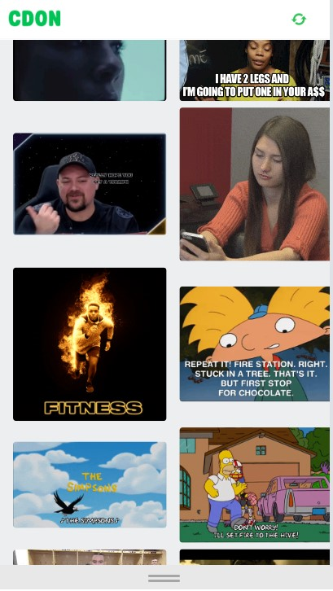

## Welcome! 👋
### Screenshot

## The challenge
The challenge is to build a responsive image gallery.

## The Design

View 1: Loading state This is shown while the gallery is being populated with images and when new images
are fetched as the user scrolls.
View 2: Gallery Refresh-icon, which should reload the gallery and fetch new, randomized images when
clicked. The images should be shown in their original proportions. Scrolling to the bottom should fetch new
images and show them (infinite scroll). Clicking / tapping an image should open View 3.
View 3: Image This view should show a larger version of the clicked / tapped image, while retaining the
imageʼs proportions. It should also show the previous and next image from the gallery and clicking / tapping
these should open the corresponding image. The close button should return the user to View 2.

- Live Site URL: [Add live site URL here]https://na-r-84.github.io/-Frontend-Developer/)

## My process

### Built with

- Semantic HTML5 markup
- CSS custom properties
- Flexbox
- Sass
- Mobile-first workflow

## Author

- Website - [Nasim Roshan](https://portfolion.nasiiimdev.se/)
